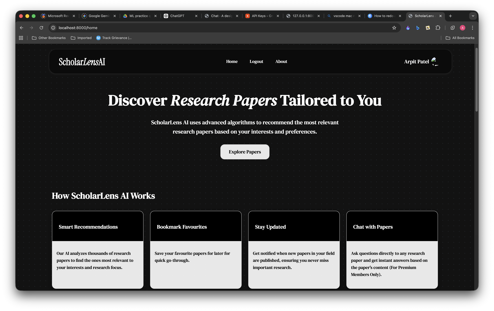
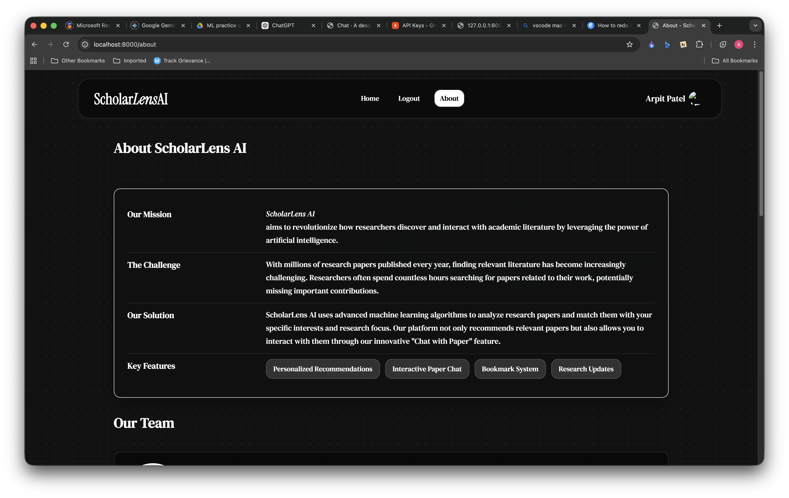
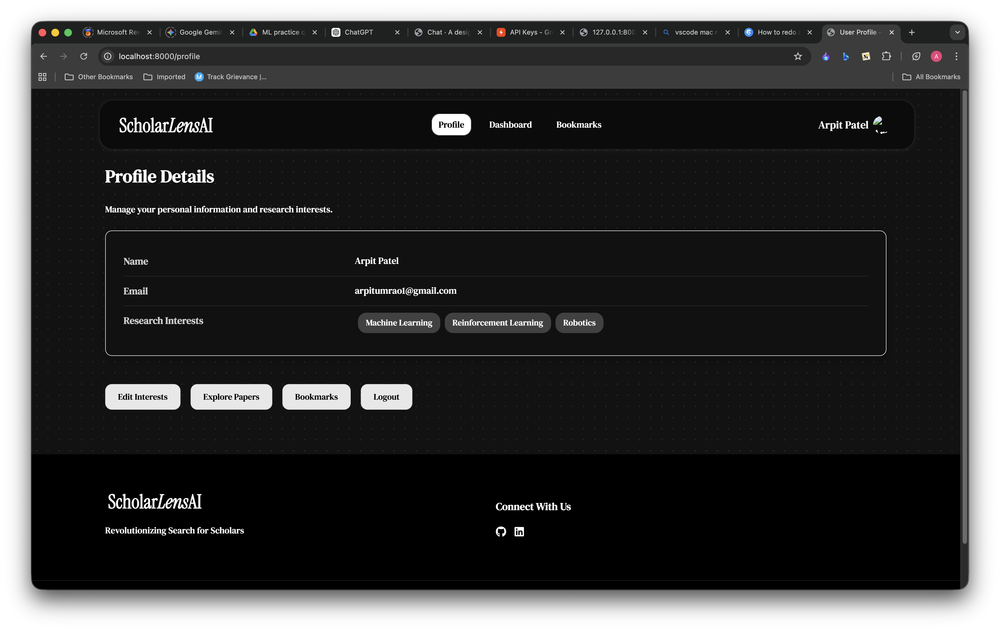
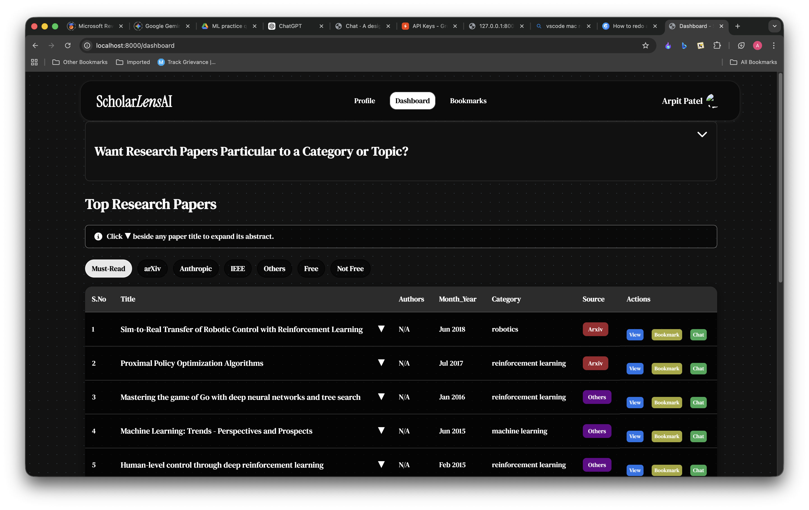
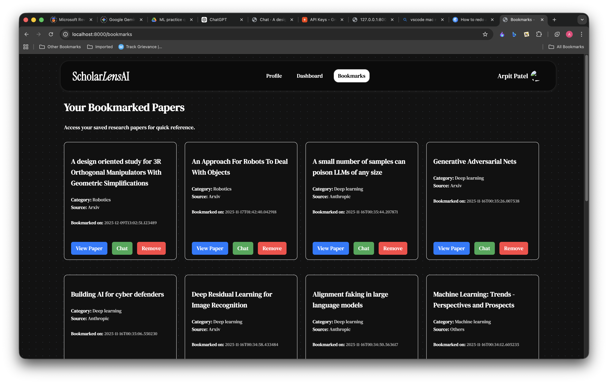
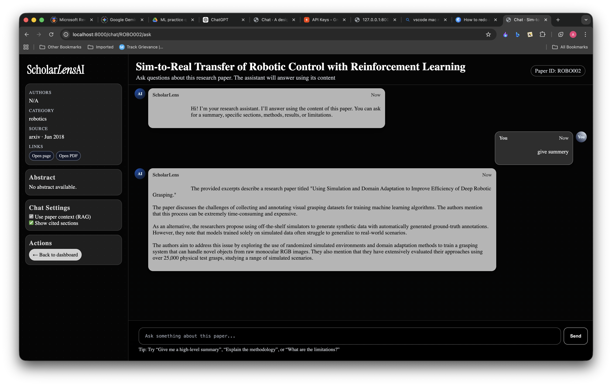

<div align="center">

# 🔬 ScholarLens AI

**AI-Powered Research Paper Discovery & Chat System**

[](https://python.org)
[](https://fastapi.tiangolo.com)
[](https://groq.com)
[](https://faiss.ai)
[](LICENSE)

*Discover papers semantically. Chat with them intelligently. Bookmark what matters.*

[Features](#-features) • [Architecture](#-architecture) • [Setup](#-setup) • [Usage](#-usage) • [Challenges](#-challenges-solved)

</div>

---

## 🧠 What is ScholarLens AI?

ScholarLens AI is an intelligent research assistant that bridges the gap between **finding** academic papers and **understanding** them.

It combines:
- 📡 **Semantic paper recommendation** via SPECTER2 embeddings
- 💬 **RAG-based paper chat** — ask questions, get answers from the actual paper
- 🔖 **User personalization** — interests, bookmarks, filtered dashboards
- 🔐 **Google OAuth** authentication

> Instead of skimming 20-page PDFs, just ask: *"What is the main contribution of this paper?"*

---

## ✨ Features

| Feature | Description |
|---|---|
| 🔍 **Semantic Search** | Find papers by topic using SPECTER2 embeddings |
| 💬 **Chat with Paper** | RAG pipeline lets you ask questions about any paper |
| 🏷️ **Category Filters** | Filter papers by research domain |
| 🔖 **Bookmarks** | Save papers to revisit later |
| 👤 **Personalization** | Dashboard tailored to your research interests |
| 🔐 **Google Login** | OAuth2-based secure authentication |

---

## 🏗️ Architecture
<div align="center">
     
  </div>

The system runs as **two independent microservices** that communicate over HTTP.

---

## 🗂️ Project Structure

```
ScholarLensAI/
│
├── app/                          # Main FastAPI application
│   ├── api/
│   │   ├── pages.py              # Page routes
│   │   ├── auth.py               # Google OAuth2
│   │   └── users.py              # User endpoints
│   ├── db/                       # SQLAlchemy models & DB setup
│   ├── utils/
│   │   └── recommend.py          # SPECTER2 recommendation engine
│   ├── templates/                # Jinja2 HTML templates
│   ├── static/                   # CSS, JS, assets
│   └── main.py                   # App entrypoint
│
├── rag_service/                  # Standalone RAG microservice
│   ├── api.py                    # FastAPI RAG endpoints
│   ├── rag_engine.py             # Core RAG pipeline
│   ├── rag_store/                # Per-paper FAISS indexes
│   │   └── <paper_id>/
│   │       ├── paper.pdf
│   │       ├── chunks.parquet
│   │       └── faiss.index
│   └── requirements.txt
│
└── requirements.txt
```

---

## ⚙️ How the RAG Pipeline Works

For each paper, the pipeline runs once and caches the result:

```
1. Download PDF  →  2. Extract Text (PyMuPDF)  →  3. Split into Chunks
        ↓
4. Generate Embeddings (SentenceTransformers)
        ↓
5. Store in FAISS Index  →  Cached at rag_store/<paper_id>/
        ↓
6. User asks a question
        ↓
7. Retrieve top-k relevant chunks
        ↓
8. Build prompt: [context chunks + question]
        ↓
9. Send to Groq (Llama 3.1)  →  Return answer
```

**Caching:** If `faiss.index` already exists for a paper, it is reused — no re-embedding needed.

---

## 🛠️ Tech Stack

**Backend**
- [FastAPI](https://fastapi.tiangolo.com) — async web framework
- [SQLAlchemy](https://sqlalchemy.org) + SQLite — ORM & database
- [httpx](https://www.python-httpx.org) — async HTTP between services

**ML / Embeddings**
- [SPECTER2](https://huggingface.co/allenai/specter2) — scientific paper embeddings
- [SentenceTransformers](https://sbert.net) — embedding library
- [FAISS](https://faiss.ai) — vector similarity search

**LLM / RAG**
- [Groq API](https://groq.com) — ultra-fast LLM inference
- [Llama 3.1](https://llama.meta.com) — underlying language model

**Data Preprocessing**
- [PyMuPDF](https://pymupdf.readthedocs.io) — PDF text extraction
- Pandas + NumPy — data processing

**Frontend**
- Jinja2 templates, HTML, CSS

**Auth**
- Google OAuth2

---

## 🚀 Setup

### Prerequisites
- Python 3.10+
- A [Groq API key](https://console.groq.com) (free tier)
- Google OAuth credentials (for login)

---

### 1. Clone the Repository

```bash
git clone https://github.com/arpitpatelsitapur/ScholarLensAI.git
cd ScholarLensAI
```

### 2. Set Up the Main App

```bash
cd app
python -m venv recom_env
source recom_env/bin/activate        # Windows: recom_env\Scripts\activate
pip install -r requirements.txt
```

### 3. Set Up the RAG Service

```bash
# Open a new terminal
cd rag_service
python -m venv rag_env
source rag_env/bin/activate          # Windows: rag_env\Scripts\activate
pip install -r requirements.txt
```

### 4. Configure Environment Variables

Create a `.env` file in the root directory:

```env
GROQ_API_KEY=your_groq_api_key_here
GOOGLE_CLIENT_ID=your_google_client_id
GOOGLE_CLIENT_SECRET=your_google_client_secret
SECRET_KEY=your_session_secret_key
```

### 5. Run Both Services

**Terminal 1 — Main app:**
```bash
cd app
uvicorn main:app --reload
# Runs at http://127.0.0.1:8000
```

**Terminal 2 — RAG service:**
```bash
cd rag_service
uvicorn api:app --port 8001 --reload
# Runs at http://127.0.0.1:8001
```

---

## 🧪 Usage

1. Open `http://127.0.0.1:8000` in your browser
2. Log in with Google
3. Set your research interests in your profile
4. Browse recommended papers on the dashboard
5. Click any paper → open **"Chat with Paper"**
6. Ask questions like:

```
What is the main contribution of this paper?
What datasets were used for evaluation?
Explain the proposed methodology in simple terms.
What are the limitations mentioned by the authors?
```

**Example:**

> **Q:** What is MAXQ decomposition?
>
> **A:** MAXQ decomposition breaks a Markov Decision Process into a hierarchy of smaller subproblems. Each subproblem has its own value function which contributes to the overall value of the parent task, enabling hierarchical reinforcement learning.

---

## Some Screenshots
<p align="center">
  
  
  
  
  
  
  
</p>


## Challenges I faced and Solved

| Challenge | Solution |
|---|---|
| **Dependency conflicts** between `transformers`, `sentence-transformers`, `huggingface_hub` | Isolated each service into its own virtual environment |
| **Microservice communication** between main app and RAG service | HTTP calls via `httpx` between FastAPI services |
| **Single-paper RAG** — original pipeline only handled one PDF | Per-paper FAISS index stored at `rag_store/<paper_id>/` |
| **Noisy PDF extraction** — hyphenation, broken formatting | PyMuPDF + post-extraction text cleaning |
| **LLM token limits** — large prompts exceeded context window | Chunk truncation, token counting, prompt length control |
| **Slow re-embedding** on repeated paper visits | Index caching — rebuild only if `faiss.index` doesn't exist |

---

## Limitations that I know this has

- Only works for papers with publicly accessible PDF URLs
- Index building takes 15–30s for the first load of a large paper
- No distributed vector store (single-node FAISS only)
- UI is functional but minimal

---


[](https://github.com/arpitpatelsitapur)

---

<div align="center">

*If this project helped you, consider giving it a ⭐*

</div>
